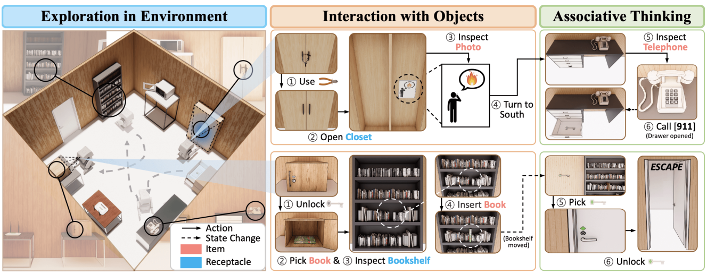

# VisEscape: A Benchmark for Evaluating Exploration-driven Decision-making in Virtual Escape Rooms

**Seungwon Lim**, **Sungwoong Kim**, **Jihwan Yu**, **Sungjae Lee**, **Jiwan Chung**, **Youngjae Yu**


Yonsei University


[](https://arxiv.org/abs/2503.14427)

## 📢Timeline
1. **[10-Oct-2025]** Full dataset and overall code are released! 
2. **[20-Aug-2025]** Accepted by **EMNLP 2025**! See VisEscape in Suzhou!
3. **[5-May-2025]** New version of the paper released! We added new experiments and analysis regarding the reasoning process of MLLMs.
4. **[23-Mar-2025]** Repo and paper released.




## Abstract
> Escape rooms present a unique cognitive challenge that demands exploration-driven planning: with the sole instruction to 'escape the room', players must actively search their environment, collecting information, and finding solutions through repeated trial and error. Motivated by this, we introduce VisEscape, a benchmark of 20 virtual escape rooms specifically designed to evaluate AI models under these challenging conditions, where success depends not only on solving isolated puzzles but also on iteratively constructing and refining spatial-temporal knowledge of a dynamically changing environment. On VisEscape, we observe that even state-of-the-art multi-modal models generally fail to escape the rooms, showing considerable variation in their progress and problem-solving approaches. We find that integrating memory management and reasoning contributes to efficient exploration and enables successive hypothesis formulation and testing, thereby leading to significant improvements in dynamic and exploration-driven environments.


## 1. Installation


1. Clone this repository.
    ```bash
    git clone https://github.com/pull-ups/VisEscape.git
    cd VisEscape
    ```
2. [Optional] Create & Activate your virtual env.
    ```bash
    conda create -n vis-escape python=3.9
    conda activate vis-escape
    ```
3. Install via poetry.
    ```bash
    pip install poetry

    # Optional: Deactivate auto virtualenv creation
    poetry config virtualenvs.create false

    poetry install
    ```


## 2. Before Running Experiments
Before running experiments, you need to make captions for each observations by running `bash ./scripts/make_caption.sh`
Image caption is required when run mode is `socratic` or Memory module of VisEscaper is used.

Captions will be saved in `./assets/[room]/captions/[model_name]/image_captions.json`

*   Note that due to github repository size limit, we downsampled all image observation's resolution to 1/16. This may cause some performance degradation regarding captioning or VLM Agent's performance. Especially, key information in visual quiz items may be lost due to image downsampling. If you want to download original high-resolution images, you can download it from https://huggingface.co/datasets/sngwon/VisEscape_Observation. After downloading, you can replace the original images in `./assets/[room]/image` with the downloaded images.


## 3. Experiment-BaseAgent
BaseAgent is a baseline agent, which does not use any module including memory and reasoning.

```bash
python scripts/run_baseagent.py room[room_number] \
    -m [model_name] \
    -n [num_experiments] \
    -t [hint_mode] \
    -r [run_mode]
```

**Parameters:**
- `model_name`: Model name defined in `src/vis_escape/config/models.yaml`. Before running specific model, you need to register the model in "models" field  and "presets" field. 
- `num_experiments`: Number of experiments to run
- `hint_mode`: 
  - `hint`: Agent receives hint messages when no checkpoint change occurs for 30 turns
  - `no_hint`: Agent receives no hint messages
- `run_mode`:
  - `vlm`: Observations provided as images, agent uses VLM for inference
  - `socratic`: Observations provided as captions (generated by `model_name`), agent uses LLM for inference. Before running experiments, you need to make captions for each observations by running `bash ./scripts/make_caption.sh`


The results will be saved in `./results/BaseAgent/`.

## 4. Experiment-VisEscaper

### 2. Run experiments

```bash
python scripts/run_visescaper.py room[room_number]
                         -m [model_name]
                         -n [num_experiments]
                         -t [hint/no_hint]
                         -r [run_mode]
```
**Parameters:**
- `model_name`: Model name defined in `endpoints.yaml`
- `num_experiments`: Number of experiments to run
- `hint_mode`: 
  - `hint`: Agent receives hint messages when no checkpoint change occurs for 30 turns
  - `no_hint`: Agent receives no hint messages
- `run_mode`:
  - `vlm`: Observations provided as images, agent uses VLM for inference
  - `socratic`: Observations provided as captions (generated by `model_name`), agent uses LLM for inference. Before running experiments, you need to make captions for each observations by running `bash ./scripts/make_caption.sh`

The results will be saved in `./results/VisEscaper/`.


## 4. Evaluation
After running experiments, you can evaluate the results by running:
```bash
python evaluation/get_score.py --trajectory [trajectory_file] --room [room_number] [--hint]
```

**Parameters:**
- `trajectory_file`: Path to the trajectory JSON file
- `room_number`: Room number (1-20)
- `hint`: If provided, statistics regarding hint will be calculated. If not provided, default is `no_hint`.


## 5. Test Escape Games by yourself!
We support running the escape rooms game by yourself in GUI mode with python library `tkinter`.

You can play the escape rooms game by executing:
```bash
python scripts/run_human.py -r room[room_number]
```


## 6. Acknowledgments


